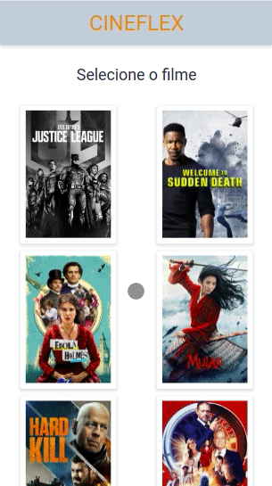

# Cineflex

An application for cinemas where you can view the movies in theaters and buy your tickets.



Try it out now at https://cineflex-orcin.vercel.app/

## Features

This is an web application that you can guarantee your movie ticket without having to leave your home

- List all movies
- Choose session day and time
- Select the seat
- Fill in your personal details 
- Complete the reservation

## Technologies
The following tools and frameworks were used in the construction of the project:<br>

  &nbsp;
  &nbsp;
  &nbsp;
  &nbsp;
  &nbsp;
  &nbsp;
  
## How to run

1. Clone this repository
2. Install dependencies
```bash
npm i
```
3. Run with
```bash
npm start
```
4. You can optionally build the project running
```bash
npm run build
```
5. Finally access http://localhost:3000 on your favorite browser (unless it is Internet Explorer. In this case, review your life decisions)